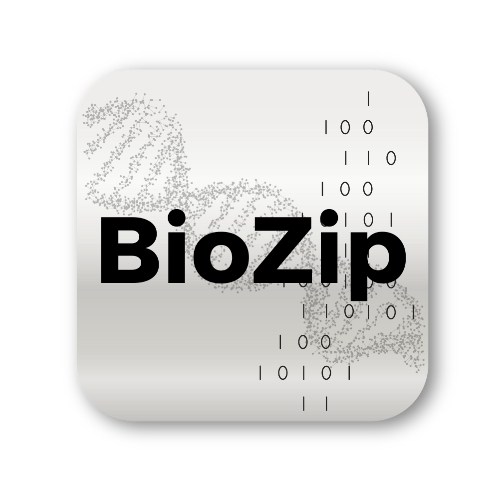
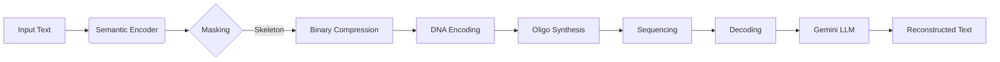
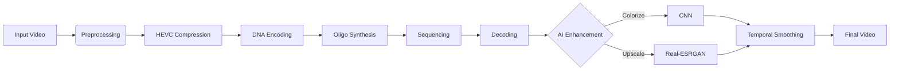

<div align="center">
  
  <h1>BioZip</h1>
  <h3>Semantic Compression for DNA Data Storage</h3>
  
  <p>
    <b>Store Smarter. Store Forever.</b><br>
    Harnessing the density of DNA and the power of Generative AI to archive humanity's data.
  </p>

  <p>
    <a href="https://www.python.org/"></a>
    <a href="https://streamlit.io/"></a>
    <a href="https://opencv.org/"></a>
    <a href="https://arxiv.org/abs/2304.01106"></a>
    <a href="LICENSE"></a>
  </p>
</div>

---

## 🧬 Overview

**BioZip** is a prototype exploring the intersection of **biological storage** and **artificial intelligence**. 

DNA offers incredible density and durability (lasting 1,000,000+ years), but writing to it is slow and expensive. BioZip solves this by using **Semantic Compression**: instead of storing every bit, we store only the "skeleton" of the data—the core meaning—and use Large Language Models (LLMs) and Generative AI to hallucinate the details back into place upon retrieval.

This repository contains the complete end-to-end workflow for both **Text** and **Video** storage on DNA.

## ✨ Key Features

### 📝 Text Pipeline: Semantic Compression
*   **Semantic Analysis:** Uses `spaCy` and `Sentence-Transformers` to identify "load-bearing" tokens.
*   **Extreme Compression:** Drops up to 70% of tokens (stopwords, connectors) while preserving the narrative arc.
*   **AI Reconstruction:** Uses **Google Gemini** to reconstruct the original text from the sparse semantic skeleton.
*   **DNA Encoding:** Huffman + Goldman encoding to ensure biological compatibility (no homopolymers).

### 🎬 Video Pipeline: Generative Restoration
*   **Grayscale Compression:** Stores video as tiny, low-res grayscale segments to save space.
*   **AI Colorization:** Uses Deep Learning (Zhang et al.) to "dream" colors back into the footage.
*   **Super-Resolution:** Upscales low-res video using **Real-ESRGAN** (x4) for crisp details.
*   **Temporal Smoothing:** Custom scene-aware stabilization to prevent flickering and ghosting.

---

## 🏗️ Architecture

### Text Pipeline


### Video Pipeline


---

## 🚀 Quick Start

### Prerequisites
*   **Python 3.11+**
*   **FFmpeg** (Required for video processing)
*   **Gemini API Key** (For text reconstruction)

### Installation

1.  **Clone the repository:**
    ```bash
    git clone https://github.com/eevenepo/read-write-grow.git
    cd read-write-grow
    ```

2.  **Set up environment:**
    ```bash
    # Using Conda (Recommended)
    conda env create -f environment.yml
    conda activate rwg-env
    
    # OR using pip
    pip install -r requirements.txt
    ```

3.  **Download models:**
    *   Ensure `spacy` model is installed: `python -m spacy download en_core_web_sm`
    *   Place video models (e.g., `RealESRGAN_x4plus.pth`, `colorization_release_v2.caffemodel`) in the `models/` directory.

### Running the App

Launch the Streamlit interface:

```bash
streamlit run app.py
```

Navigate to `http://localhost:8501` in your browser.

---

## 🖥️ Usage Guide

### 1. Text Demo
*   **Encode:** Paste any text. Adjust the "Masking Ratio" to see how much you can compress while keeping the meaning. Download the DNA file.
*   **Decode:** Upload the DNA file. Watch Gemini reconstruct the original text from the skeleton.

### 2. Video Demo
*   **Encode:** Upload a short video clip (mp4/mov). The system will compress, segment, and encode it into DNA oligos.
*   **Decode:** Upload the DNA file. The system will decode the raw video and apply AI Colorization and Upscaling to restore it.

---

## 📚 References

*   **Semantic Compression:** *Language Models as Semantic Compressors* (Delétang et al., 2023)
*   **DNA Encoding:** *Towards practical, high-capacity, low-maintenance information storage in synthesized DNA* (Goldman et al., 2013)
*   **Colorization:** *Colorful Image Colorization* (Zhang et al., 2016)
*   **Super-Resolution:** *Real-ESRGAN: Training Real-World Blind Super-Resolution with Pure Synthetic Data* (Wang et al., 2021)

---

## 👥 Authors

*   **Valeria Jackson Sandoval**
*   **Emiel Evenepoel**
*   **Yichen Fu**

---

<div align="center">
  <sub>Built for the Read-Write-Grow Hackathon 2025</sub>
</div>
