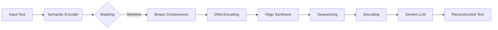
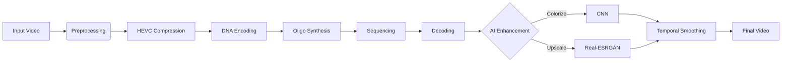

<div align="center">
  
  <h1>BioZip</h1>
  <h3>Semantic Compression for DNA Data Storage</h3>
  
  <p>
    <b>Store Smarter. Store Forever.</b><br>
    Harnessing the density of DNA and the power of Generative AI to archive humanity's data.
  </p>

  <p>
    <a href="https://www.python.org/"></a>
    <a href="https://streamlit.io/"></a>
    <a href="https://opencv.org/"></a>
    <a href="https://arxiv.org/abs/2304.01106"></a>
    <a href="LICENSE"></a>
  </p>
</div>

---

## 🧬 Overview

**BioZip** is a prototype exploring the intersection of **biological storage** and **artificial intelligence**. 

DNA offers incredible density (~215 petabytes per gram) and durability (lasting 1,000,000+ years under proper conditions), but writing to it is slow and expensive (~$0.05-0.10 per nucleotide for synthesis). BioZip addresses this challenge through **Semantic Compression**: instead of storing every bit, we store only the "skeleton" of the data—the core semantic meaning—and leverage Large Language Models (LLMs) and Generative AI to reconstruct the missing details upon retrieval.

This repository contains the complete end-to-end workflow for both **Text** and **Video** storage on DNA, with automatic environment detection for seamless deployment across local development and cloud hosting.

## ✨ Key Features

### 📝 Text Pipeline: Semantic Compression
*   **Semantic Analysis:** Uses `spaCy` for part-of-speech tagging and `Sentence-Transformers` for embedding-based importance scoring to identify "load-bearing" tokens—words that carry the core meaning of the text.
*   **Intelligent Masking:** Drops up to 70% of tokens (stopwords, common connectors, low-importance words) while preserving the narrative arc and semantic structure. The masking ratio is user-configurable.
*   **AI Reconstruction:** Uses **Google Gemini 2.5 Flash** to reconstruct grammatically correct, contextually appropriate text from the sparse semantic skeleton.
*   **Biological DNA Encoding:** Implements Huffman coding for efficient byte-to-ternary conversion, followed by Goldman encoding (rotating base scheme) to ensure biological compatibility—eliminating homopolymers that cause synthesis errors.

### 🎬 Video Pipeline: Generative Restoration
*   **Extreme Preprocessing:** Converts video to tiny resolution (default 160×90) and grayscale, reducing data by ~95% while preserving essential visual information.
*   **HEVC Compression:** Uses FFmpeg with libx265 (H.265/HEVC) codec at high CRF values (40+) for aggressive compression with fixed GOP sizes for clean segmentation.
*   **Segment-based Encoding:** Splits video into independent 2-second segments, each encoded as a separate DNA oligo pool for fault-tolerant storage and parallel processing.
*   **AI Colorization (Local Only):** Deep Learning colorizer (Zhang et al., ECCV 2016) analyzes luminance and predicts chrominance channels, "hallucinating" plausible colors based on semantic content.
*   **Super-Resolution (Local Only):** Real-ESRGAN (x4) upscales video using a GAN trained on real-world images, reconstructing high-frequency details and sharp edges.
*   **Temporal Smoothing:** Scene-aware stabilization algorithm that blends adjacent frames to reduce AI-induced flickering while detecting scene changes to prevent ghosting artifacts.

---

## 🖥️ Deployment Modes

BioZip automatically detects its runtime environment and adjusts available features accordingly:

| Feature | ☁️ Streamlit Cloud | 💻 Local Development |
|---------|-------------------|---------------------|
| **Text Encoding** | ✅ Full support | ✅ Full support |
| **Text Decoding (Gemini)** | ✅ Full support | ✅ Full support |
| **Video Encoding** | ✅ Full support | ✅ Full support |
| **Video Decoding (Base)** | ✅ Grayscale output | ✅ Grayscale output |
| **AI Colorization** | ❌ Disabled | ✅ Full support |
| **AI Upscaling (ESRGAN)** | ❌ Disabled | ✅ Full support |
| **Temporal Smoothing** | ✅ Always applied | ✅ Always applied |

### Why the difference?

**Streamlit Cloud** has resource limitations (no GPU, limited memory, model size constraints) that make running heavy AI models like Real-ESRGAN impractical. The colorization and upscaling models require:
- ~500MB+ of model weights
- Significant CPU/GPU compute per frame
- Memory for batch processing

For the **full experience with AI enhancement**, run BioZip locally where these models can leverage your hardware.

> 💡 **Tip:** The app automatically detects Streamlit Cloud by checking for `/mount/src` (Streamlit's repo mount point) and environment variables like `STREAMLIT_SHARING_MODE`.

---

## 🏗️ Architecture

### Text Pipeline


### Video Pipeline


> ⚠️ **Note:** On Streamlit Cloud, the AI Enhancement stage (Colorize + Upscale) is bypassed. The decoded video is output as grayscale with temporal smoothing only.

---

## 🚀 Quick Start

### Prerequisites
*   **Python 3.11+**
*   **FFmpeg** (Required for video processing - install via `brew install ffmpeg` on macOS or `apt install ffmpeg` on Linux)
*   **Gemini API Key** (For text reconstruction - get one at [Google AI Studio](https://aistudio.google.com/))

### Installation

1.  **Clone the repository:**
    ```bash
    git clone https://github.com/eevenepo/read-write-grow.git
    cd read-write-grow
    ```

2.  **Set up environment:**
    ```bash
    # Using pip with virtual environment (Recommended)
    python -m venv venv
    source venv/bin/activate  # On Windows: venv\Scripts\activate
    pip install -r requirements.txt
    
    # OR using Conda
    conda env create -f environment.yml
    conda activate rwg-env
    ```

3.  **Download models for AI enhancement (optional but recommended for local):**
    *   Ensure `spacy` model is installed: `python -m spacy download en_core_web_sm`
    *   Download video enhancement models and place in `models/` directory:
        - `RealESRGAN_x4plus.pth` - [Download from Real-ESRGAN releases](https://github.com/xinntao/Real-ESRGAN/releases)
        - `colorization_release_v2.caffemodel` - [Download from colorization repo](https://github.com/richzhang/colorization)
        - `colorization_deploy_v2.prototxt` - Network architecture file
        - `pts_in_hull.npy` - Color quantization centers

4.  **Set up environment variables:**
    ```bash
    # Create a .env file or export directly
    export GEMINI_API_KEY="your-api-key-here"
    
    # Optional: Force development mode
    export ENV="development"
    ```

### Running the App

**Local Development (Full Features):**
```bash
streamlit run app.py
```
Navigate to `http://localhost:8501` in your browser. All features including AI colorization and upscaling will be available.

**Streamlit Cloud Deployment:**
The app automatically detects cloud deployment and disables resource-intensive AI features. Simply connect your GitHub repo to Streamlit Cloud and add your `GEMINI_API_KEY` to the Secrets management.

---

## 🖥️ Usage Guide

### 1. Text Pipeline Demo
*   **Encode:** 
    - Paste any text (up to 10,000 characters)
    - Adjust the "Masking Ratio" slider (0.1 = keep 90% of tokens, 0.7 = keep only 30%)
    - Watch the semantic skeleton form in real-time
    - Download the DNA oligo file (`.txt` format, one sequence per line)
*   **Decode:** 
    - Upload the DNA file
    - Gemini reconstructs grammatically correct text from the sparse skeleton
    - Compare original vs reconstructed to evaluate semantic preservation

### 2. Video Pipeline Demo
*   **Encode:** 
    - Upload a short video clip (mp4/mov/mkv, recommended <10 seconds for demo)
    - Adjust preprocessing settings: resolution (default 160×90), FPS (default 12), CRF compression (default 40)
    - The system converts to grayscale, compresses with HEVC, segments, and encodes to DNA
    - Download the DNA oligo file with cost estimate
*   **Decode:** 
    - Upload the DNA oligo file
    - Ensure decoding settings match encoding settings (resolution, FPS)
    - **On Local:** Enable AI Colorization and/or ESRGAN Upscaling for full restoration
    - **On Cloud:** Receive grayscale output with temporal smoothing only
    - Download the reconstructed video

### Settings Sidebar
The sidebar displays your current environment:
- **"Running on: Local"** — All features available including AI enhancement
- **"Running on: Streamlit Cloud"** — AI enhancement disabled, basic encoding/decoding available

---

## 📚 References

*   **Semantic Compression:** *Language Models as Semantic Compressors* (Delétang et al., 2023)
*   **DNA Encoding:** *Towards practical, high-capacity, low-maintenance information storage in synthesized DNA* (Goldman et al., 2013)
*   **Colorization:** *Colorful Image Colorization* (Zhang et al., 2016)
*   **Super-Resolution:** *Real-ESRGAN: Training Real-World Blind Super-Resolution with Pure Synthetic Data* (Wang et al., 2021)

---

## 👥 Authors

*   **Valeria Jackson Sandoval**
*   **Emiel Evenepoel**
*   **Yichen Fu**

---

<div align="center">
  <sub>Built for the Read-Write-Grow Hackathon 2025</sub>
</div>
